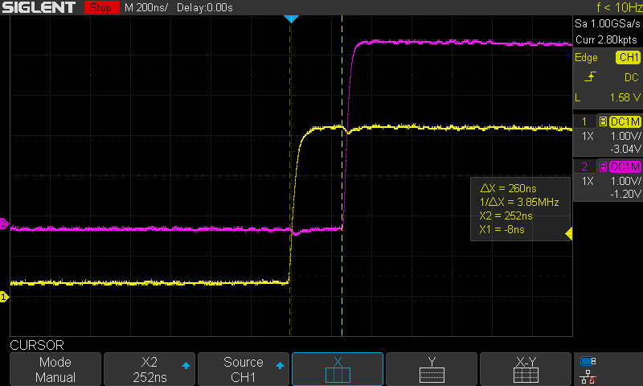

# Time synchronization on two microcontrollers using the I2C interface

19th May 2021

## Introduction

The I2C interface interrupts can be used to synchronize the time on two (or more) microcontrollers. An event that occurs almost simultaneously on both processors is the start of an I2C interrupt, eg "SLA + W sent and ACK received" on master and "SLA + W received, ACK returned" on slave.

Tests were carried out on two AVR Atmega88PA processors with a 16MHz clock.
The following image shows the rising edges of the signal set at the beginning of the interrupt routine. The time difference between the two CPUs is approximately 260ns. 

 

*.prj files are project files for VMLab (ver. 3.15) simulation.

AVR fuses can be set in make command (see makefile).

## Links

* [avr-gcc](https://gcc.gnu.org/wiki/avr-gcc)
* [avr-libc](https://www.nongnu.org/avr-libc/user-manual/index.html)
* [AVR Atmega88PA](https://www.microchip.com/wwwproducts/en/ATmega88PA) - documentation
* [I2C](https://i2c.info/) - info
* [I2C](https://www.nxp.com/docs/en/user-guide/UM10204.pdf) - specification and user manual (NXP)

## License

This project is licensed under the MIT License.

## Authors

* **Krzysztof Zurek** - [github](https://github.com/KrzysztofZurek1973)

